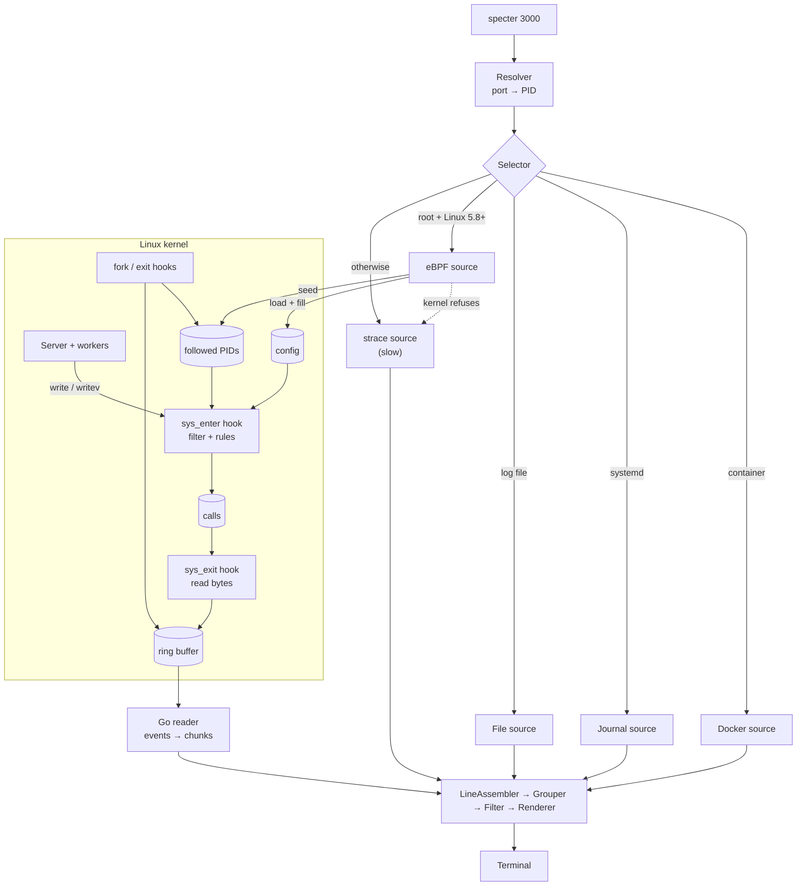

# eBPF source: system design

```mermaid
flowchart TB
    U["specter 3000"] --> R["Resolver<br/>port → PID"]
    R --> S{"Selector"}

    S -->|container| D["Docker source"]
    S -->|systemd| J["Journal source"]
    S -->|log file| F["File source"]
    S -->|root + Linux 5.8+| E["eBPF source"]
    S -->|otherwise| T["strace source<br/>(slow)"]
    E -.->|kernel refuses| T

    subgraph KERNEL["Linux kernel"]
        APP["Server + workers"] -->|write / writev| EN["sys_enter hook<br/>filter + rules"]
        CFG[("config")] --> EN
        FOL[("followed PIDs")] --> EN
        EN --> CALLS[("calls")]
        CALLS --> EX["sys_exit hook<br/>read bytes"]
        FX["fork / exit hooks"] --> FOL
        EX --> RB[("ring buffer")]
        FX --> RB
    end

    E -->|load + fill| CFG
    E -->|seed| FOL
    RB --> GO["Go reader<br/>events → chunks"]

    GO --> P["LineAssembler → Grouper → Filter → Renderer"]
    D --> P
    J --> P
    F --> P
    T --> P
    P --> OUT["Terminal"]
```
